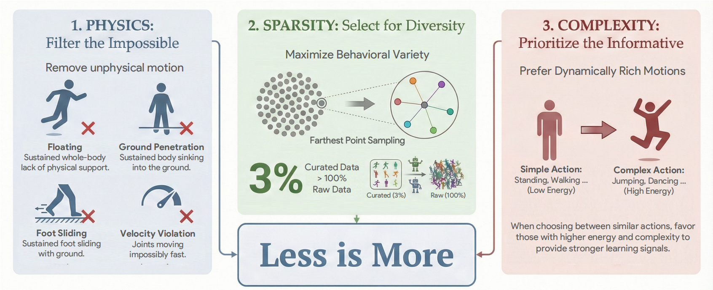

<div align="center">

# 🎯 LIMMT

### [ICML 2026] Less is More for Motion Tracking

<p align="center">
  <a href="https://icml.cc/Conferences/2026"></a>
  <a href="https://arxiv.org/abs/2606.06953"></a>
  <a href="https://giraffeguan.github.io/limmt/"></a>
  <a href="../LICENSE"></a>
</p>

<p align="center">
  
</p>

</div>

---

## 📖 Overview

This document describes the **General Quality Selection (GQS)** pipeline from [LIMMT](https://arxiv.org/abs/2606.06953). GQS is a three-stage data curation framework that transforms a large, noisy motion corpus into a compact, high-value training subset — the **first data-centric study for physics-based humanoid motion tracking**.

> **Key finding**: Training on just **3% of curated AMASS data** consistently outperforms training on the full dataset across multiple tracking systems (Any2Track, TWIST2) and datasets (AMASS, PHUMA), in a **plug-and-play** manner.

<details>
<summary><b>🔬 Key Contributions</b></summary>

- **Data-Centric Perspective**: Quality over quantity — physics feasibility, action diversity, and action complexity are the decisive factors for robust tracking, not dataset scale.
- **General Quality Selection (GQS)**: A hierarchical pipeline that eliminates physically infeasible artifacts, then maximizes behavioral coverage and dynamic richness via harmonic embeddings.
- **Less-Is-More Paradigm**: Training on just **3% of curated AMASS** consistently outperforms the full corpus across all evaluated metrics.
- **Plug-and-Play Gains**: Improvements transfer across diverse trackers and datasets, and to real-world **Unitree G1** deployment without fine-tuning.

</details>

### ✨ Highlights

| Feature                  | Description                                                                 |
|--------------------------|-----------------------------------------------------------------------------|
| 🧹 **Physics Filtering** | Simulator-grounded feasibility scoring removes toxic artifacts              |
| 🌐 **Semantic Embedding**| Harmonic Motion Embedding (Periodic Autoencoder) for a phase-invariant manifold |
| 📐 **Weighted FPS**      | Complexity-weighted diversity sampling over the embedding space             |
| 📉 **Efficiency**        | 3% curated data beats 100% full dataset; ~15% MPJPE improvement             |

---

## 🗺️ Pipeline

```
┌─────────────────────────────────────────────────────────────────────────┐
│                            GQS Pipeline                                 │
├─────────────────────────────────────────────────────────────────────────┤
│                                                                         │
│   ┌───────────┐    ┌───────────┐    ┌───────────┐    ┌───────────┐      │
│   │    Raw    │    │  Physics  │    │  Semantic │    │  Global   │      │
│   │  Motions  │───▶│  Filter   │───▶│ Embedding │───▶│   W-FPS   │      │
│   │           │    │ (Stage I) │    │ (Stage II)│    │(Stage III)│      │
│   └───────────┘    └───────────┘    └───────────┘    └───────────┘      │
│                                                                         │
│     Input:         Remove           Learn Phase-       Complexity-      │
│     Large          Infeasible       Robust Motion       Weighted        │
│     Corpus         Motions          Manifold (HME)     Diversity FPS    │
│                                                                         │
└─────────────────────────────────────────────────────────────────────────┘
```

Motion data quality is defined through three dimensions:
- **Physics Feasibility**: Can the motion be realized by a rigid-body humanoid?
- **Diversity**: Does the library cover distinct behaviors rather than repeating frequent patterns?
- **Complexity**: Do motions provide informative, dynamic supervision (high energy) rather than near-stationary segments?

The staged ordering is critical: filtering must come first to prevent broken motions from dominating the embedding space; embedding must operate on feasible data; complexity weighting comes last.

---

## 📦 Prerequisites: Preprocess Trajectories

```bash
python tracking/convert_parallel.py \
    --src_dir storage/mocap/amass_train \
    --save_dir storage/mocap/amass_train_convert \
    --num_workers 32
```

---

## 🧹 Stage I: Physics-based Feasibility Filtering

Simulator-grounded filtering that replays each candidate motion in a rigid-body simulator and computes a composite feasibility score.

### Soft Scoring

For valid trajectories, a quality score is computed: **S_phy = 100 − Σ(w_i × L_i)**, penalizing six physical violation modes. Trajectories with **S_phy ≥ 90** are retained.

```bash
python -m projects.gqs.physics_filter \
    --mocap_dir storage/mocap/amass_train_convert \
    --score_json_path storage/gqs_score/amass_train.json \
    --output_dir storage/mocap/amass_train_filtered \
    --threshold 90.0
```

<details>
<summary><b>📊 Calibrated Penalty Weights</b></summary>

Weights are calibrated via sensitivity analysis — metrics harmful to policy learning receive high penalty weights, while metrics correlated with valuable dynamic motions receive low weights.

| Metric         | Impact | Role     | Weight (w_i) |
|----------------|--------|----------|--------------|
| Floating       | +2.6   | Toxic    | 24.19        |
| Foot Slide     | +1.0   | Toxic    | 1.70         |
| Penetration    | -0.2   | Neutral  | 216.62       |
| Jerk           | -0.6   | Neutral  | 0.28         |
| Velocity       | -2.8   | Friendly | 44.22        |
| Self Collision | -3.0   | Friendly | 0.17         |

- **Toxic**: Filtering improves performance → penalize heavily
- **Friendly**: Filtering *degrades* performance (valuable dynamic motions) → penalize lightly
- **Neutral**: Negligible impact → safety constraint

</details>

---

## 🌐 Stage II: Semantic Motion Embedding (HME)

Learn a continuous motion manifold using a **Periodic Autoencoder (PAE)** that captures structural and rhythmic similarity of behaviors. The HME embeddings provide a metric space where distances reflect behavioral diversity.

```bash
python -m projects.hme.train \
    --mocap_dir storage/mocap/amass_train_convert \
    --hme_ckpt storage/hme_ckpt/amass.pt
```

<details>
<summary><b>📊 HME Architecture</b></summary>

The Periodic Autoencoder extracts phase-amplitude representations:

```
Input Motion ──▶ Conv1D Encoder ──▶ FFT Analysis ──▶ Phase/Amplitude ──▶ Embedding
       │                                                                     │
       └──────────────── Reconstruction Loss ◀── Conv1D Decoder ◀────────────┘
```

The encoder maps input to dynamic parameters in frequency domain:
- **Amplitude (A)**: Motion intensity
- **Frequency (F)**: Motion pace
- **Phase Shift (φ)**: Temporal alignment (discarded for global embedding)
- **Offset (b)**: Pose bias (discarded for global embedding)

**Global Embedding**: For each trajectory, `z_global = mean([A_w, F_w])` across temporal windows, yielding a compact, phase-invariant descriptor.

</details>

---

## 📐 Stage III: Global Weighted FPS Selection

Perform diversity-aware, complexity-weighted subset selection over the HME embedding space.

```bash
python -m projects.gqs.global_weighted_fps \
    --mocap_dir storage/mocap/amass_train_pass \
    --hme_ckpt storage/hme_ckpt/amass.pt \
    --output_base_dir storage/mocap/amass_selected \
    --selection_ratio 0.2 \
    --alpha 0.6
```

<details>
<summary><b>📊 Algorithm & Parameters</b></summary>

**Complexity Metric**: `C(x) = (1/T) Σ (‖q̇‖² + λ‖q̈‖²)`, combining kinetic energy and acceleration magnitude.

**Scoring**: `Score(u) = α · D̂(u, S) + (1 − α) · Ĉ(u)`
- `D̂`: Normalized distance to nearest selected neighbor (diversity)
- `Ĉ`: Rank-normalized complexity score
- `α`: Trade-off between diversity and complexity

| Parameter         | Description                                 | Default   |
|-------------------|---------------------------------------------|-----------|
| `selection_ratio` | Fraction of motions to select               | 0.2 (20%) |
| `alpha`           | Weight: diversity (1.0) vs complexity (0.0) | 0.6       |
| `threshold`       | Physics score threshold for Stage I         | 90.0      |

**Global vs. Cluster-based**: Global FPS is preferred — it naturally re-balances the distribution by skipping dense redundant clusters and targeting sparse boundaries.

</details>

---

## 📋 Quick Reference

| Stage | Component      | Input                          | Output                      |
|-------|----------------|--------------------------------|-----------------------------|
| 0     | Preprocess     | Raw mocap data                 | Converted trajectories      |
| I     | Physics Filter | Converted trajectories         | Physically feasible motions |
| II    | HME Embedding  | Feasible motions               | Phase-invariant embeddings  |
| III   | Global W-FPS   | Embeddings + complexity scores | Curated high-quality subset |

---

## 📊 Main Results on AMASS

GQS at **3% data** outperforms the full-data baseline across all metrics, while a random 3% subset causes catastrophic collapse — the "less is more" effect comes from using the **right** data, not less data.

| Method              | Physics Filter | FPS Ratio | Success Rate ↑    | MPJPE (rad) ↓     | MPKPE (mm) ↓     |
|---------------------|----------------|-----------|-------------------|-------------------|------------------|
| Any2Track           | ✗              | —         | 0.942 ± 0.011     | 0.114 ± 0.003     | 39.24 ± 1.12     |
| Any2Track + Random  | ✓              | Random 3% | 0.838 ± 0.018     | 0.159 ± 0.005     | 158.76 ± 14.34   |
| Any2Track + GQS     | ✓              | 100%      | 0.954 ± 0.011     | 0.112 ± 0.003     | 34.12 ± 0.95     |
| **Any2Track + GQS** | ✓              | **3%**    | 0.956 ± 0.012     | 0.108 ± 0.002     | **29.87 ± 0.76** |
| TWIST2              | ✗              | —         | 0.825 ± 0.014     | 0.099 ± 0.003     | 35.80 ± 1.08     |
| TWIST2 + Random     | ✓              | Random 3% | 0.649 ± 0.021     | 0.177 ± 0.006     | 263.19 ± 27.87   |
| TWIST2 + GQS        | ✓              | 100%      | 0.843 ± 0.012     | 0.094 ± 0.003     | 31.25 ± 0.89     |
| **TWIST2 + GQS**    | ✓              | **3%**    | 0.861 ± 0.013     | 0.092 ± 0.002     | **27.09 ± 0.68** |

See the [project page](https://giraffeguan.github.io/limmt/) for full ablations, training dynamics, cross-domain transfer, and real-world Unitree G1 deployment videos.

---

## 📚 Citation

```bibtex
@article{guan2026limmt,
    title   = {LIMMT: Less is More for Motion Tracking},
    author  = {Guan, Yu and Qi, Zekun and Lin, Chenghuai and Chen, Xuchuan and Liu, Dairu and
               Zhang, Wenyao and Wang, Jilong and Yu, Xinqiang and Wang, He and Yi, Li},
    journal = {arXiv preprint arXiv:2606.06953},
    year    = {2026}
}
```

---

<div align="center">
  <a href="../README.md">← Back to README</a>
</div>
